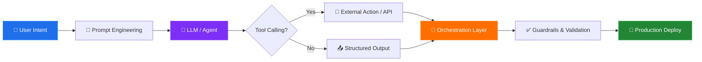

<div align="center">


</div>

<div align="center">

[](https://git.io/typing-svg)

[](mailto:ajaneeshwar05@gmail.com)
[](https://www.linkedin.com/in/ajaneeshwar)
[](https://github.com/Ajaneeshwar)


</div>

---

## `whoami`

```yaml
name     : Ajaneeshwar S
alias    : AjEE
role     : AI Engineer @ The Vertical AI
location : Chennai, Tamil Nadu, India
education: B.Tech AI & Data Science — CGPA 8.55 | Dept. Rank 3rd
focus    : Agentic AI · RAG Pipelines · LLM Orchestration · Multi-Agent Systems
belief   : "I design systems. I ship solutions. I don't memorize syntax — I engineer outcomes."
```

I think in **architectures, pipelines, and workflows**. I follow **AI-SDLC**: Rapid Prototype → MVP → Iterate → Ship. Every system I build is designed for **reliability, scalability, and real-world impact** — not just demos.

---

## Experience

```
🟢  Jan 2026 – Present       AI Engineer          @ The Vertical AI          (Chennai)
🔵  Sep 2025 – Jan 2026      Jr. AI & Data Sci.   @ WebDads2U                (Chennai) — Sole AI/LLM Resource
🟡  Apr 2025 – May 2025      Data Scientist Intern @ iZEN Training Academy   (Chennai)
🟣  Jun 2023 – Dec 2025      Freelance AI/Data Consultant                    (Hybrid)
```

**Highlight:** At WebDads2U, owned the entire AI pipeline solo — from fine-tuning to deployment. Improved model accuracy from **72% → 93%**.

---

## Tech Stack

<div align="center">

**Languages**


**GenAI / LLM Engineering**


**ML / Data Science**


**Backend & APIs**


**Databases & Vector Stores**


**Cloud & DevOps**


</div>

---

## How I Think — The AI Engineering Loop



> Every system I build follows this loop — from intent to production, with **zero hand-waving in between**.

---

## GitHub Stats

<div align="center">


<br/>


</div>

---

## Research & Publications

| Paper | Venue | Date |
|---|---|---|
| **Automated Text Recognition from Visuals using OpenCV** | International Conference, Bishop Heber College, Trichy — *Applied Mathematical Techniques & Bio-Inspired Computations* (ISBN: 978-93-93333-67-4) | Feb 2025 |
| **Natural Language to SQL Query Execution App** | International Conference on AI & Data Science, Velammal Institute of Technology, Chennai | May 2025 |

---

## Impact & Leadership

<div align="center">

| Achievement | Impact |
|:---|:---|
| 🎓 Student Mentorship | Guided **300+ students** on AI/ML, placements & career growth |
| 🎤 AI Workshops | Conducted sessions with **99% positive feedback** |
| 🏅 Academic Rank | **Department Rank 3rd** — First Class with Distinction |
| 📢 Conference Speaker | Presented at **2 International Conferences** |
| 📈 Model Performance | Pushed accuracy **72% → 93%** in production at WebDads2U |

</div>

---

## Certifications

<div align="center">


</div>

---

<div align="center">

*"I don't chase programming — I chase engineering.*
*I don't memorize frameworks — I understand systems.*
*I don't build demos — I ship MVPs that solve real problems."*

[](mailto:ajaneeshwar05@gmail.com)
[](https://www.linkedin.com/in/ajaneeshwar)
[](https://github.com/Ajaneeshwar)

</div>


