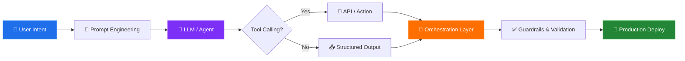

<!-- Header Banner -->
<div align="center">
  
  

  [](https://git.io/typing-svg)

</div>

---

## 🧠 `whoami`

```yaml
name: Ajaneeshwar S
alias: AjEE
role: AI Engineer @ The Vertical AI
location: Chennai, Tamil Nadu, India
education: B.Tech AI & Data Science (CGPA: 8.55)
philosophy: "I don't write code for the sake of code — I engineer solutions."
```

> **I'm not the guy who memorizes syntax — I'm the guy who designs systems.**  
> I think in architectures, pipelines, and workflows. I use AI not just as a tool, but as an engineering discipline —  
> from prompt design to agent orchestration to production deployment.  
> I follow **AI-SDLC**, I build **quick MVPs**, and I ship **client-facing solutions** that actually work.  
> Continuous learner. Relentless builder. Engineering-first mindset.

---

## 💼 About Me

- 🔭 Currently working as an **AI Engineer at The Vertical AI**, building production AI systems
- 🧪 Previously the **sole AI/LLM resource** at WebDads2U — owned everything from fine-tuning to deployment
- 🎓 **B.Tech in AI & Data Science** — Department Rank 3rd (First Class with Distinction)
- 📚 **Mentored 300+ students** in AI/ML, placements, and career readiness
- 📄 **2 International Research Publications** — presented at conferences in Trichy & Chennai
- 🧩 I focus on **AI Engineering** — not just writing code, but thinking about systems, context, orchestration, and reliability
- ⚡ I believe in **AI-SDLC**: Rapid prototyping → MVP → Iterate → Ship

---

## 🏢 Experience Timeline

```
🟢 Jan 2026 – Present    AI Engineer @ The Vertical AI (Chennai)
🔵 Sep 2025 – Jan 2026   Junior AI & Data Scientist @ WebDads2U (Chennai) — Sole AI/LLM Resource
🟡 Apr 2025 – May 2025   Data Scientist Intern @ iZEN Training Academy (Chennai)
🟣 Jun 2023 – Dec 2025   Freelance Data & AI Consultant (Hybrid)
```

---

## 🛠️ Tech Stack & Tools

<div align="center">

### 🐍 Languages


### 🤖 GenAI / LLM Engineering


### 📚 ML / Data Science


### ⚙️ Backend & APIs


### 🗄️ Databases & Vector Stores


### ☁️ Cloud & DevOps


### 🧰 Tools & Platforms


</div>

---

## 🚀 Featured Projects

<div align="center">

<a href="https://github.com/Ajaneeshwar/aws-ai-agents-analytics">
  
</a>
<a href="https://github.com/Ajaneeshwar/ai-engineer-agent">
  
</a>
<a href="https://github.com/Ajaneeshwar/Natural-Language-To-Sql-Query-generation-using-Gen-Ai">
  
</a>
<a href="https://github.com/Ajaneeshwar/Automated-text-recognition">
  
</a>
<a href="https://github.com/Ajaneeshwar/Predicting-Customer-Churn-for-Telecom-Growth">
  
</a>
<a href="https://github.com/Ajaneeshwar/Flask-Authentication-API-with-OTP-based-2FA">
  
</a>

</div>

---

## 🧬 What I Build — My Engineering DNA



<table>
<tr>
<td width="50%">

### 🏗️ AI Engineering
- Agentic AI Workflows & Multi-Agent Systems
- Tool Calling & Action Routing
- Structured Outputs & Anti-Hallucination
- LangChain & LangGraph Orchestration
- MCP Context Management
- Evaluation Frameworks (Semantic Similarity, Rule-based)

</td>
<td width="50%">

### ⚡ Quick Prototyping & MVPs
- AI-SDLC Methodology
- Prompt → Product Pipeline
- FastAPI / Flask Backend Integration
- RAG Pipelines with Vector DBs
- LLM Fine-tuning (LoRA, QLoRA)
- Production Deployment with Guardrails

</td>
</tr>
</table>

---

## 📊 GitHub Stats

<div align="center">

<a href="https://github.com/Ajaneeshwar">
  
  
</a>

<br/>


</div>

---

## 📜 Research & Publications

| 📄 Paper | 🏛️ Venue | 📅 Date |
|----------|----------|---------|
| **Automated Text Recognition from Visuals using OpenCV** | International Conference, Bishop Heber College, Trichy — *Published in Applied Mathematical Techniques & Bio-Inspired Computations* (ISBN: 978-93-93333-67-4) | Feb 2025 |
| **Natural Language to SQL Query Execution App** | International Conference on AI & Data Science, Velammal Institute of Technology, Chennai | May 2025 |

---

## 🏅 Certifications

<div align="center">


-NPTEL-1A73E8?style=flat-square&logoColor=white)


</div>

---

## 🎯 Leadership & Impact

<div align="center">

| 🏆 Achievement | 📊 Impact |
|:---|:---|
| 🎓 Student Mentorship | Mentored **300+ students** on AI/ML, placements & career growth |
| 🎤 AI Workshops | Conducted workshops with **99% positive feedback** |
| 🏅 Academic Rank | **Department Rank 3rd** — First Class with Distinction |
| 📢 Conference Speaker | Presented at **2 International Conferences** |
| 👨‍💻 Team Leadership | Led **multiple AI/ML teams** from concept to deployment |
| 📈 Model Performance | Improved model accuracy from **72% → 93%** at WebDads2U |

</div>

---

## 🌐 Connect With Me

<div align="center">

[](mailto:ajaneeshwar05@gmail.com)
[](https://www.linkedin.com/in/ajaneeshwar)
[](https://github.com/Ajaneeshwar)

</div>

---

<div align="center">
  
  ### 💭 My Philosophy
  
  *"I don't chase programming — I chase engineering.<br/>I don't memorize frameworks — I understand systems.<br/>I don't build demos — I ship MVPs that solve real problems."*

  <br/>
  
  

</div>


