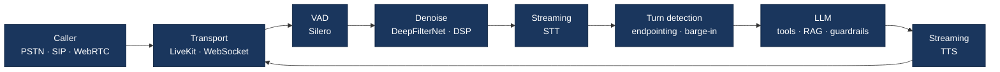

# Ajaneeshwar S

**Voice AI & Agentic Systems Engineer**

Real-time speech pipelines · Conversational agent orchestration · Telephony · LLM platforms

---

I build **voice agents that hold a real conversation** — and the unglamorous layers underneath that make them work: streaming audio transport, turn-taking, provider orchestration, telephony, evaluation and guardrails.

Most of my day is spent on latency, interruption handling and the places where a pipeline quietly breaks. Around that I ship the rest of the system too — agentic LLM backends, RAG, full-stack interfaces, and the Docker/Kubernetes infrastructure it all runs on.

Currently **Lead AI Engineer @ TheVertical.ai**, where I own production delivery and deployment across the team's AI products.

---

## The pipeline I work in

```mermaid
flowchart LR
    A["Caller<br/>PSTN · SIP · WebRTC"] --> B["Transport<br/>LiveKit · WebSocket"]
    B --> C["VAD<br/>Silero"]
    C --> D["Denoise<br/>DeepFilterNet · DSP"]
    D --> E["Streaming<br/>STT"]
    E --> F["Turn detection<br/>endpointing · barge-in"]
    F --> G["LLM<br/>tools · RAG · guardrails"]
    G --> H["Streaming<br/>TTS"]
    H --> B

    classDef stage fill:#1A365D,stroke:#0F2440,stroke-width:1px,color:#FFFFFF
    class A,B,C,D,E,F,G,H stage
```

Every stage is swappable, instrumented, and measured — because in voice the failure modes are *latency* and *turn-taking*, not accuracy.

---

## Featured open source

### 🎧 [SpectraHush](https://github.com/Ajaneeshwar/SpectraHush)
Streaming implementation of **Berouti-style modified spectral subtraction** for real-time noise reduction. Classical DSP, no model weights, no GPU — runs in the audio callback.

`Python` · `DSP` · `speech-enhancement`

### 🎙️ [DenoiseStream](https://github.com/Ajaneeshwar/DenoiseStream)
Real-time microphone noise suppression streamed over **WebSocket**, with pluggable Spectral Gate and DeepFilterNet backends behind one interface — swap the denoiser without touching the transport.

`Python` · `WebSocket` · `DeepFilterNet` · `realtime-audio`

---

## Production work

Source is private, so here's what I've actually built:

| | |
|---|---|
| **Real-time speech pipeline** | Modular STT providers behind one interface, VAD-gated denoising with live resampling, WebSocket audio streaming, and a turn-gating controller emitting partial / final / early-final / interruption events. |
| **Agent orchestration layer** | Full-duplex agents on **Pipecat** with Silero VAD, end-of-turn detection and true barge-in. Provider registries for STT / LLM / TTS / embeddings with config merge, validation, per-tenant dispatch and secret masking — any provider swaps per client with no code change. |
| **Custom telephony layer** | Inbound, outbound and warm-transfer flows over PSTN/SIP trunks and **LiveKit** rooms — WebRTC signalling, telephony webhooks, WebSocket media streams, call disposition codes, and in-call tool calling for transfer, termination and callback scheduling. |
| **Campaign dialling engine** | Event-driven outbound orchestration over Redis pub/sub — batch scheduling, stale-campaign recovery, retries, rate limiting and concurrency caps behind circuit breakers. |
| **Agent evaluation harness** | Two agents run against each other over an internal transport with *configurable simulated network latency*, recording every session so turn-taking, latency and dialogue quality are regression-tested before release. |
| **Autoprompter** | Prompt-optimisation workbench — generates prompts with guardrails, synthesises eval cases, runs GEPA rewrite search, and gates promotion behind regression checks. |
| **Voice fine-tuning** | Moved a 19-node conversation graph with per-turn RAG to per-client **LoRA adapters hot-swapped via vLLM multi-LoRA**, after tracing format hallucination and routing failure back to prompt overload. |

---

## Stack

**Voice & speech**

**LLM & agents**

**Engineering**

---

<b>More projects</b>

 

- **[AWS AI Agents for Business Analytics](https://github.com/Ajaneeshwar/aws-ai-agents-analytics)** — agentic system on Bedrock AgentCore for cloud cost analytics: tool orchestration over structured pricing data, LLM-driven code execution, session management and guardrails.
- **[Fuzzy LLM-RAG](https://github.com/Ajaneeshwar/Fuzzy-llm-rag-a-hybrid-approach)** — hybrid retrieval combining fuzzy matching with dense embeddings.
- **[AI Engineer Agent](https://github.com/Ajaneeshwar/ai-engineer-agent)** — autonomous coding agent experiment.
- **[NL-to-SQL Query Generation](https://github.com/Ajaneeshwar/Natural-Language-To-Sql-Query-generation-using-Gen-Ai)** — natural-language interface over SQL databases with dynamic schema detection.
- **[Flask Auth API with OTP 2FA](https://github.com/Ajaneeshwar/Flask-Authentication-API-with-OTP-based-2FA)** — production-ready auth service: JWT, email OTP, rate limiting, Bcrypt.
- **[Python Complete Bootcamp](https://github.com/Ajaneeshwar/python-complete-bootcamp)** — full Python course I wrote for freshers.
- **[Automated Text Recognition](https://github.com/Ajaneeshwar/Automated-text-recognition)** — OpenCV + Tesseract OCR over images, video and live camera.
- **[Telecom Churn Prediction](https://github.com/Ajaneeshwar/Predicting-Customer-Churn-for-Telecom-Growth)** — 93.3% AUC with XGBoost, feature engineering and social-network analysis.

---

## Writing & recognition

- 📄 **Published** — *"Automated Text Recognition from Visuals using OpenCV"*, International Conference on Applied Mathematical Techniques and Bio-Inspired Computations (ISBN 978-93-93333-67-4)
- 🎤 **Presented** — *"Natural Language to SQL Query Execution App"*, International Conference on AI & Data Science
- 👥 **Mentoring** — trained 75+ students on AI/ML and ran AI productivity and placement workshops

---

Open to conversations about voice AI, real-time systems and agent infrastructure.

